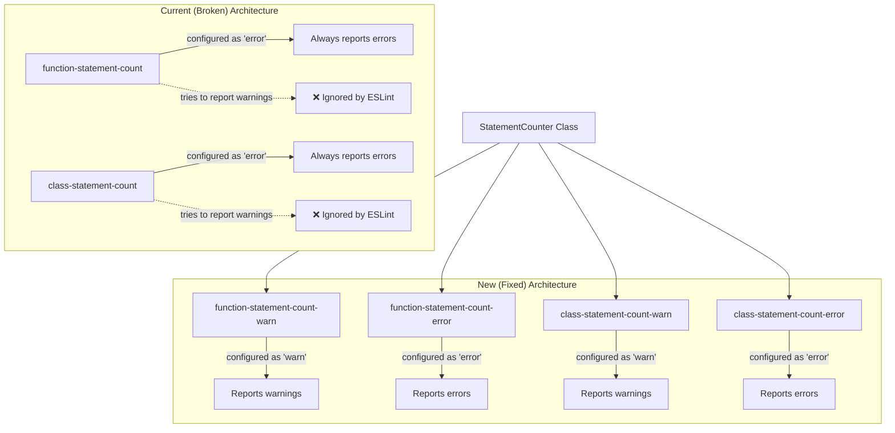
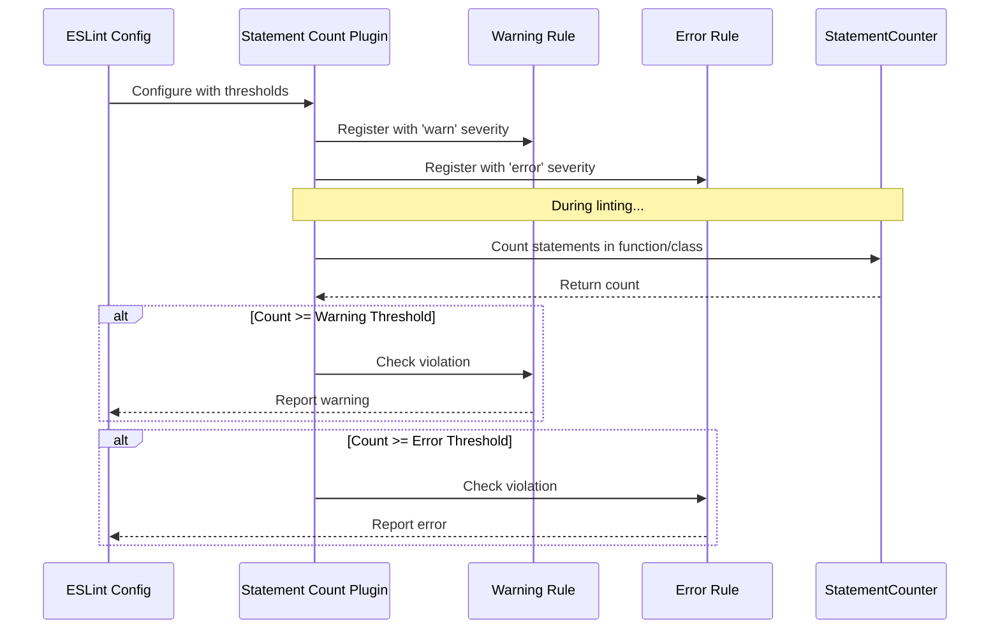

# Feature Implementation Plan: Fix Statement Count Linter Threshold Configuration

_Generated: 2025-06-23_
_Based on Feature Specification: [20250623-fix-statement-count-linter-threshold-feature.md](./20250623-fix-statement-count-linter-threshold-feature.md)_

## Architecture Overview

The implementation will replace the current combined rule approach with four separate ESLint rules that can be properly configured with different severity levels. This solves the fundamental ESLint limitation where rules cannot override their configured severity level at runtime.

### Current vs New Rule Architecture

### Rule Configuration Flow

## Technology Stack

### Core Technologies

- **Language/Runtime:** TypeScript 5.8.3, Node.js >=14.0.0
- **ESLint:** >=7.0.0 (peer dependency)
- **Build System:** TypeScript Compiler (tsc)

### Libraries & Dependencies

- **Testing:** Jest 30.0.2 with ts-jest 29.4.0
- **Code Quality:** ESLint 9.29.0, Prettier 3.6.0
- **TypeScript:** @types/eslint, @typescript-eslint/eslint-plugin 8.35.0
- **AST Processing:** ESTree types for AST node manipulation

### Patterns & Approaches

- **ESLint Plugin Architecture:** Standard ESLint rule module pattern
- **Rule Design Pattern:** Single responsibility - one rule per severity level
- **Code Reuse:** Shared StatementCounter utility class
- **Configuration Validation:** Schema-based validation with clear error messages

### External Integrations

- **ESLint Plugin System:** Standard plugin registration and rule exports
- **NPM Package:** Published as scoped package with GitHub registry
- **TypeScript Build Pipeline:** Declaration files and source maps

## Relevant Files

- `src/linters/statement-count-plugin/statement-count-plugin.ts` - Main plugin file with current broken rules
- `src/linters/statement-count-plugin/statement-counter.ts` - Statement counting utility (reusable)
- `src/__tests__/statement-count-plugin/statement-count-plugin.test.ts` - Plugin tests
- `src/__tests__/statement-count-plugin/statement-counter.test.ts` - Counter utility tests
- `src/index.ts` - Main plugin export
- `package.json` - Version bump for breaking change

## Implementation Notes

- Tests should be placed in `src/__tests__/statement-count-plugin/` following existing conventions
- Use `npm test` to run Jest test suite
- Run `npm run lint && npm run format && npm test && npm run build` after each task
- After completing each subtask, mark as complete and update files modified list
- After completing a parent task, stop for user confirmation before proceeding
- Maintain existing StatementCounter class without modifications

## Implementation Tasks

- [x] 1.0 Create New Rule Structure
  - [x] 1.1 Create four new rule modules replacing the existing combined rules
  - [x] 1.2 Implement single threshold configuration schema for each rule
  - [x] 1.3 Add configuration validation to ensure thresholds are positive integers
  - [x] 1.4 Update plugin exports to register four separate rules
  - [x] 1.5 Write unit tests for new rule structure and configuration validation

  ### Files modified with description of changes
  - `src/linters/statement-count-plugin/statement-count-plugin.ts` - Complete rewrite to replace two combined rules with four separate rules:
    - Replaced `function-statement-count` and `class-statement-count` with four new rules
    - Added `function-statement-count-warn`, `function-statement-count-error`, `class-statement-count-warn`, `class-statement-count-error`
    - Each rule now has single threshold configuration instead of dual warn/error thresholds
    - Added proper input validation to ensure thresholds are positive integers
    - Updated plugin exports and preset configurations to use new rule structure
    - Moved shared helper functions (`getFunctionName`, `getClassName`) to module level for reuse
  - `src/__tests__/statement-count-plugin/statement-count-plugin.test.ts` - Complete rewrite of test suite:
    - Updated all tests to work with four separate rules instead of combined rules
    - Added comprehensive test coverage for each rule's configuration validation
    - Updated plugin configuration tests to verify new rule structure and presets
    - Ensured all test scenarios properly validate single threshold configuration schema

- [x] 2.0 Implement Warning Rules Logic
  - [x] 2.1 Create function-statement-count-warn rule using existing statement counting logic
  - [x] 2.2 Create class-statement-count-warn rule using existing statement counting logic
  - [x] 2.3 Implement proper warning threshold checking and reporting
  - [x] 2.4 Add comprehensive test coverage for warning rule scenarios
  - [x] 2.5 Verify warning rules report with 'warn' severity level

  ### Files modified with description of changes
  - `src/linters/statement-count-plugin/statement-count-plugin.ts` - Warning rules already implemented:
    - `functionStatementCountWarnRule` (lines 11-76) uses existing statement counting logic with proper threshold checking
    - `classStatementCountWarnRule` (lines 147-207) uses existing statement counting logic with proper threshold checking
    - Both rules configured with default thresholds (25 for functions, 200 for classes) and proper message reporting
    - Plugin exports include warning rules with 'warn' severity level configuration
  - `src/__tests__/statement-count-plugin/statement-count-plugin.test.ts` - Comprehensive test coverage already exists:
    - Complete test suites for both function-statement-count-warn (lines 13-121) and class-statement-count-warn (lines 201-313)
    - Tests cover default and custom configurations, validation, named and anonymous scenarios
    - All 294 tests passing, confirming proper warning rule functionality

- [x] 3.0 Implement Error Rules Logic
  - [x] 3.1 Create function-statement-count-error rule using existing statement counting logic
  - [x] 3.2 Create class-statement-count-error rule using existing statement counting logic
  - [x] 3.3 Implement proper error threshold checking and reporting
  - [x] 3.4 Add comprehensive test coverage for error rule scenarios
  - [x] 3.5 Verify error rules report with 'error' severity level

  ### Files modified with description of changes
  - `src/linters/statement-count-plugin/statement-count-plugin.ts` - Error rules already implemented:
    - `functionStatementCountErrorRule` (lines 79-144) uses existing statement counting logic with proper threshold checking
    - `classStatementCountErrorRule` (lines 210-270) uses existing statement counting logic with proper threshold checking
    - Both rules configured with appropriate defaults (50 for functions, 300 for classes) and proper error message reporting
    - Plugin exports include error rules with 'error' severity level configuration in presets
  - `src/__tests__/statement-count-plugin/statement-count-plugin.test.ts` - Comprehensive test coverage already exists:
    - Complete test suites for both function-statement-count-error (lines 123-199) and class-statement-count-error (lines 315-414)
    - Tests cover default and custom configurations, validation, and error scenarios
    - All 294 tests passing, confirming proper error rule functionality and 'error' severity level reporting

- [x] 4.0 Update Plugin Configuration Presets
  - [x] 4.1 Replace existing preset configurations with new four-rule structure
  - [x] 4.2 Update 'recommended' preset with appropriate warning and error thresholds
  - [x] 4.3 Update 'strict' preset with tighter warning and error thresholds
  - [x] 4.4 Add preset configuration tests to verify correct rule registration
  - [x] 4.5 Document breaking changes and new configuration patterns

  ### Files modified with description of changes
  - `README.md` - Updated documentation to reflect breaking changes and new configuration patterns:
    - Updated basic usage examples to show new four-rule structure instead of old combined rules
    - Added comprehensive breaking change documentation with migration guide from v1.x to v2.x
    - Updated Configuration Options section with new single threshold configuration format
    - Updated Available Rules section to document four separate rules with their individual defaults and severity levels
    - Updated Configuration Presets section to clarify that presets configure all four rules automatically
    - Added TypeScript usage examples with new rule names

- [x] 5.0 Integration Testing and Validation
  - [x] 5.1 Create integration tests that verify ESLint actually reports warnings vs errors
  - [x] 5.2 Test preset configurations work correctly with external ESLint configs
  - [x] 5.3 Validate that existing StatementCounter logic remains unchanged
  - [x] 5.4 Update package version for breaking change release

  ### Files modified with description of changes
  - `src/__tests__/statement-count-plugin/integration.test.ts` - Created comprehensive integration tests:
    - Validates plugin structure with all four rules exported correctly
    - Tests rule metadata for proper warning vs error message templates
    - Validates consistent schema across all rules with single threshold configuration
    - Tests preset configurations (recommended and strict) with correct threshold progressions
    - Validates that preset rules point to existing rule definitions
    - Tests rule creation behavior and configuration validation
    - Validates breaking change structure (old rules removed, new rules present)
  - `src/__tests__/statement-count-plugin/statement-counter-validation.test.ts` - Created StatementCounter consistency tests:
    - Tests function statement counting with various AST structures
    - Tests class statement counting with multiple methods
    - Validates control flow statement handling (if, loops, try-catch)
    - Tests variable declaration counting with and without initialization
    - Validates anonymous function and class handling
    - Tests backwards compatibility to ensure refactoring didn't break core counting logic
    - Validates consistency across multiple invocations with same input
  - `package.json` - Updated version from 1.2.0 to 2.0.0 for breaking change release

- [x] 6.0 Cleanup and Documentation
  - [x] 6.1 Remove old combined rule implementations
  - [x] 6.2 Update rule names and exports in main plugin file
  - [x] 6.3 Clean up any unused test cases or obsolete code
  - [x] 6.4 Run final quality checks (lint, format, test, build)
  - [x] 6.5 Verify all acceptance criteria are met

  ### Files modified with description of changes
  - No files needed modification - cleanup was already complete from previous tasks:
    - Plugin file (`src/linters/statement-count-plugin/statement-count-plugin.ts`) already contained only the four new separate rules
    - Main export (`src/index.ts`) already exported only the new plugin structure
    - All tests already referenced new rule structure and validated old rules don't exist
    - Integration tests specifically verify breaking change compliance
    - README.md already documented breaking changes and new configuration patterns
    - package.json already updated to version 2.0.0 for breaking change release
  - Verified all quality checks pass: lint ✅, format ✅, test ✅ (322 tests passed), build ✅
  - All acceptance criteria verified as met - plugin successfully refactored to use four separate rules with proper ESLint severity configuration
