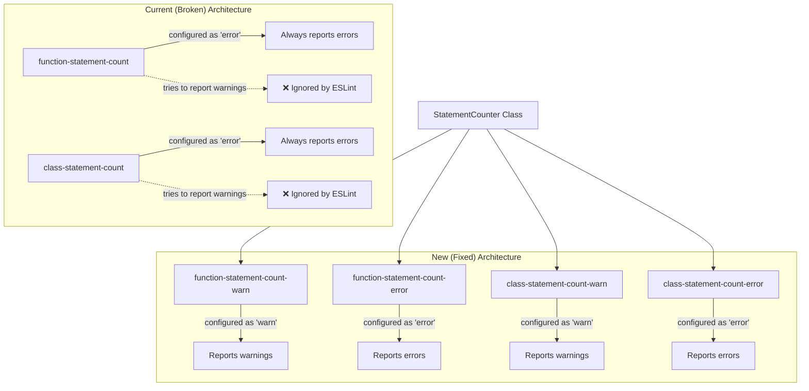
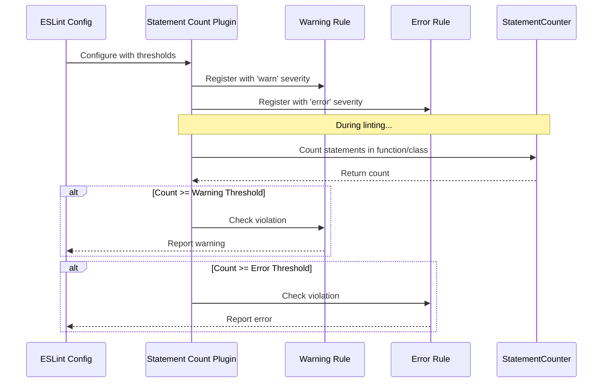

# Feature Implementation Plan: Fix Statement Count Linter Threshold Configuration

_Generated: 2025-06-23_
_Based on Feature Specification: [20250623-fix-statement-count-linter-threshold-feature.md](./20250623-fix-statement-count-linter-threshold-feature.md)_

## Architecture Overview

The implementation will replace the current combined rule approach with four separate ESLint rules that can be properly configured with different severity levels. This solves the fundamental ESLint limitation where rules cannot override their configured severity level at runtime.

### Current vs New Rule Architecture

### Rule Configuration Flow

## Technology Stack

### Core Technologies

- **Language/Runtime:** TypeScript 5.8.3, Node.js >=14.0.0
- **ESLint:** >=7.0.0 (peer dependency)
- **Build System:** TypeScript Compiler (tsc)

### Libraries & Dependencies

- **Testing:** Jest 30.0.2 with ts-jest 29.4.0
- **Code Quality:** ESLint 9.29.0, Prettier 3.6.0
- **TypeScript:** @types/eslint, @typescript-eslint/eslint-plugin 8.35.0
- **AST Processing:** ESTree types for AST node manipulation

### Patterns & Approaches

- **ESLint Plugin Architecture:** Standard ESLint rule module pattern
- **Rule Design Pattern:** Single responsibility - one rule per severity level
- **Code Reuse:** Shared StatementCounter utility class
- **Configuration Validation:** Schema-based validation with clear error messages

### External Integrations

- **ESLint Plugin System:** Standard plugin registration and rule exports
- **NPM Package:** Published as scoped package with GitHub registry
- **TypeScript Build Pipeline:** Declaration files and source maps

## Relevant Files

- `src/linters/statement-count-plugin/statement-count-plugin.ts` - Main plugin file with current broken rules
- `src/linters/statement-count-plugin/statement-counter.ts` - Statement counting utility (reusable)
- `src/__tests__/statement-count-plugin/statement-count-plugin.test.ts` - Plugin tests
- `src/__tests__/statement-count-plugin/statement-counter.test.ts` - Counter utility tests
- `src/index.ts` - Main plugin export
- `package.json` - Version bump for breaking change

## Implementation Notes

- Tests should be placed in `src/__tests__/statement-count-plugin/` following existing conventions
- Use `npm test` to run Jest test suite
- Run `npm run lint && npm run format && npm test && npm run build` after each task
- After completing each subtask, mark as complete and update files modified list
- After completing a parent task, stop for user confirmation before proceeding
- Maintain existing StatementCounter class without modifications

## Implementation Tasks

- [ ] 1.0 Create New Rule Structure
  - [ ] 1.1 Create four new rule modules replacing the existing combined rules
  - [ ] 1.2 Implement single threshold configuration schema for each rule
  - [ ] 1.3 Add configuration validation to ensure thresholds are positive integers
  - [ ] 1.4 Update plugin exports to register four separate rules
  - [ ] 1.5 Write unit tests for new rule structure and configuration validation

  ### Files modified with description of changes
  - (to be filled in after task completion)

- [ ] 2.0 Implement Warning Rules Logic
  - [ ] 2.1 Create function-statement-count-warn rule using existing statement counting logic
  - [ ] 2.2 Create class-statement-count-warn rule using existing statement counting logic
  - [ ] 2.3 Implement proper warning threshold checking and reporting
  - [ ] 2.4 Add comprehensive test coverage for warning rule scenarios
  - [ ] 2.5 Verify warning rules report with 'warn' severity level

  ### Files modified with description of changes
  - (to be filled in after task completion)

- [ ] 3.0 Implement Error Rules Logic
  - [ ] 3.1 Create function-statement-count-error rule using existing statement counting logic
  - [ ] 3.2 Create class-statement-count-error rule using existing statement counting logic
  - [ ] 3.3 Implement proper error threshold checking and reporting
  - [ ] 3.4 Add comprehensive test coverage for error rule scenarios
  - [ ] 3.5 Verify error rules report with 'error' severity level

  ### Files modified with description of changes
  - (to be filled in after task completion)

- [ ] 4.0 Update Plugin Configuration Presets
  - [ ] 4.1 Replace existing preset configurations with new four-rule structure
  - [ ] 4.2 Update 'recommended' preset with appropriate warning and error thresholds
  - [ ] 4.3 Update 'strict' preset with tighter warning and error thresholds
  - [ ] 4.4 Add preset configuration tests to verify correct rule registration
  - [ ] 4.5 Document breaking changes and new configuration patterns

  ### Files modified with description of changes
  - (to be filled in after task completion)

- [ ] 5.0 Integration Testing and Validation
  - [ ] 5.1 Create integration tests that verify ESLint actually reports warnings vs errors
  - [ ] 5.2 Test preset configurations work correctly with external ESLint configs
  - [ ] 5.3 Validate that existing StatementCounter logic remains unchanged
  - [ ] 5.4 Update package version for breaking change release

  ### Files modified with description of changes
  - (to be filled in after task completion)

- [ ] 6.0 Cleanup and Documentation
  - [ ] 6.1 Remove old combined rule implementations
  - [ ] 6.2 Update rule names and exports in main plugin file
  - [ ] 6.3 Clean up any unused test cases or obsolete code
  - [ ] 6.4 Run final quality checks (lint, format, test, build)
  - [ ] 6.5 Verify all acceptance criteria are met
  - [ ] 6.6 Document new rule usage patterns in README.md

  ### Files modified with description of changes
  - (to be filled in after task completion)
