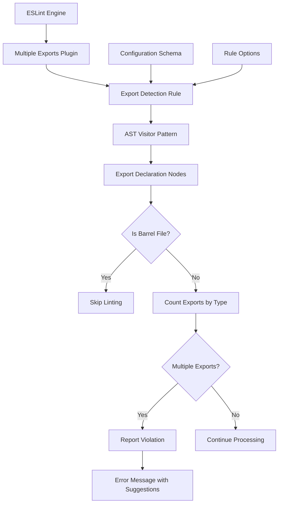
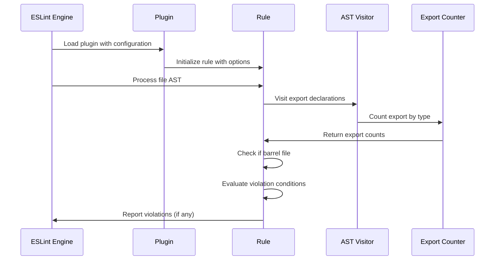

# Feature Implementation Plan: Multiple Exports Linter

_Generated: 2025-06-23_
_Based on Feature Specification: .tasks/20250623/20250623-multiple-exports-linter-feature.md_

## Architecture Overview

The multiple exports linter will be implemented as an ESLint plugin that uses AST (Abstract Syntax Tree) traversal to detect multiple export declarations within a single file. The plugin follows the established pattern used by existing plugins in the codebase, specifically the statement-count-plugin architecture.

### System Architecture

### Data Flow

## Technology Stack

### Core Technologies

- **Language/Runtime:** TypeScript 5.x with strict mode
- **Framework:** ESLint Rule API v9.x
- **Testing:** Jest 30.x with ts-jest preset
- **Build System:** TypeScript compiler (tsc)

### Libraries & Dependencies

- **ESLint Integration:** @types/eslint, ESTree AST types
- **Testing:** @types/jest, RuleTester from ESLint
- **Development:** Prettier, Husky for pre-commit hooks
- **Type Safety:** @typescript-eslint/parser and plugin

### Patterns & Approaches

- **Architectural Patterns:** ESLint Rule Module pattern, AST Visitor pattern
- **Design Patterns:** Strategy pattern for export type checking
- **Development Practices:** Test-driven development, Configuration schema validation

### External Integrations

- **ESLint API:** Rule.RuleModule interface, RuleTester for testing
- **AST Processing:** ESTree node types for JavaScript/TypeScript parsing
- **Build Pipeline:** Integration with existing npm scripts (lint, test, build)

## Relevant Files

- `src/linters/multiple-exports-plugin/multiple-exports-plugin.ts` - Main plugin implementation
- `src/linters/multiple-exports-plugin/export-detector.ts` - Export detection logic
- `src/__tests__/multiple-exports-plugin/multiple-exports-plugin.test.ts` - Plugin tests
- `src/__tests__/multiple-exports-plugin/export-detector.test.ts` - Export detector tests
- `src/index.ts` - Plugin export registration
- `src/types.ts` - Type definitions (existing)

## Implementation Notes

- Tests should be placed in `src/__tests__/multiple-exports-plugin/` following the existing convention
- Use `npm test` to run the Jest test suite
- Follow the existing file naming and directory structure conventions
- After completing each subtask, mark it as complete and run `npm run lint && npm run format && npm test && npm run build`
- After completing a parent task, stop and wait for user confirmation before proceeding
- Use the ESLint RuleTester for comprehensive rule testing scenarios

## Implementation Tasks

- [x] 1.0 **Core Plugin Structure Setup**
  - [x] 1.1 Create plugin directory structure (`src/linters/multiple-exports-plugin/`)
  - [x] 1.2 Implement basic plugin scaffolding with ESLintPlugin interface
  - [x] 1.3 Define configuration schema for export type checking options
  - [x] 1.4 Set up barrel file detection utility function
  - [x] 1.5 Create initial test file structure and basic test setup

  ### Files modified with description of changes
  - `src/linters/multiple-exports-plugin/multiple-exports-plugin.ts` - Main plugin implementation with ESLint rule structure, configuration schema, and rule logic for detecting multiple exports
  - `src/linters/multiple-exports-plugin/export-detector.ts` - Utility functions for detecting exports, analyzing barrel files, and categorizing export types
  - `src/__tests__/multiple-exports-plugin/multiple-exports-plugin.test.ts` - Comprehensive test suite for the main plugin with various scenarios including barrel file exemption and configuration options
  - `src/__tests__/multiple-exports-plugin/export-detector.test.ts` - Unit tests for the export detector utility functions covering all export types and edge cases

- [x] 2.0 **Export Detection Logic Implementation**
  - [x] 2.1 Implement AST visitor for ExportNamedDeclaration and ExportDefaultDeclaration nodes
  - [x] 2.2 Create export counting logic for classes, functions, and interfaces
  - [x] 2.3 Add export type classification (class/function/interface identification)
  - [x] 2.4 Implement configuration-based filtering of export types to check
  - [x] 2.5 Write comprehensive tests for export detection scenarios

  ### Files modified with description of changes
  - `src/linters/multiple-exports-plugin/export-detector.ts` - Enhanced TypeScript support with proper AST node detection for interfaces, types, and enums; added export counting utilities (`countExportsByType`, `hasMultipleExportsOfType`); improved export classification with functions for categorizing by runtime vs type-only exports; added detailed export summary generation
  - `src/linters/multiple-exports-plugin/multiple-exports-plugin.ts` - Improved AST visitor logic to handle export specifiers more efficiently; enhanced configuration-based filtering in violation detection; integrated detailed export summary reporting for better error messages
  - `src/__tests__/multiple-exports-plugin/export-detector.test.ts` - Added comprehensive tests for all new utility functions including export counting, classification, and TypeScript support; enhanced coverage for configuration options and edge cases
  - `src/__tests__/multiple-exports-plugin/multiple-exports-plugin.test.ts` - Updated existing tests to match enhanced error message format; added new test scenarios for TypeScript constructs and configuration filtering; improved test coverage for barrel file exemption and mixed export scenarios

- [x] 3.0 **Rule Logic and Violation Detection**
  - [x] 3.1 Implement main rule logic with context.report() for violations
  - [x] 3.2 Create clear error messages with export details and suggestions
  - [x] 3.3 Add support for both warning and error severity levels
  - [x] 3.4 Implement rule configuration validation and error handling
  - [x] 3.5 Write tests for rule logic, error messages, and configuration scenarios

  ### Files modified with description of changes
  - `src/linters/multiple-exports-plugin/multiple-exports-plugin.ts` - Enhanced error messages to provide more specific and actionable suggestions for developers when multiple exports are detected, including guidance on splitting files or creating barrel files

- [ ] 4.0 **Integration and Configuration**
  - [ ] 4.1 Add plugin export to main index.ts file
  - [ ] 4.2 Create recommended and strict configuration presets
  - [ ] 4.3 Implement plugin metadata (description, docs, schema)
  - [ ] 4.4 Add integration tests with various TypeScript/JavaScript file scenarios
  - [ ] 4.5 Test plugin integration with existing ESLint configurations

  ### Files modified with description of changes
  - (to be filled in after task completion)

- [ ] 5.0 **Comprehensive Testing and Edge Cases**
  - [ ] 5.1 Test barrel file exemption scenarios (index.ts, index.js variations)
  - [ ] 5.2 Test mixed export scenarios (default + named, various combinations)
  - [ ] 5.3 Test configuration options (enabling/disabling specific export types)
  - [ ] 5.4 Test edge cases (re-exports, namespace exports, type-only exports)
  - [ ] 5.5 Performance testing with large files and complex export scenarios

  ### Files modified with description of changes
  - (to be filled in after task completion)

- [ ] 6.0 **Quality Assurance and Documentation**
  - [ ] 6.1 Run full quality pipeline (lint, format, test, build) and fix any issues
  - [ ] 6.2 Verify rule works correctly with existing codebase files
  - [ ] 6.3 Test plugin installation and configuration scenarios
  - [ ] 6.4 Update documentation with usage examples and configuration options
  - [ ] 6.5 Final integration testing with all quality tools passing

  ### Files modified with description of changes
  - (to be filled in after task completion)
