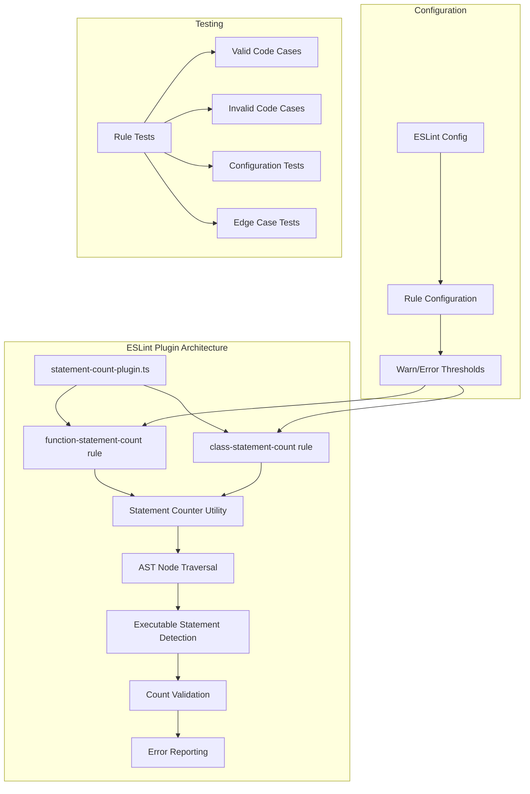
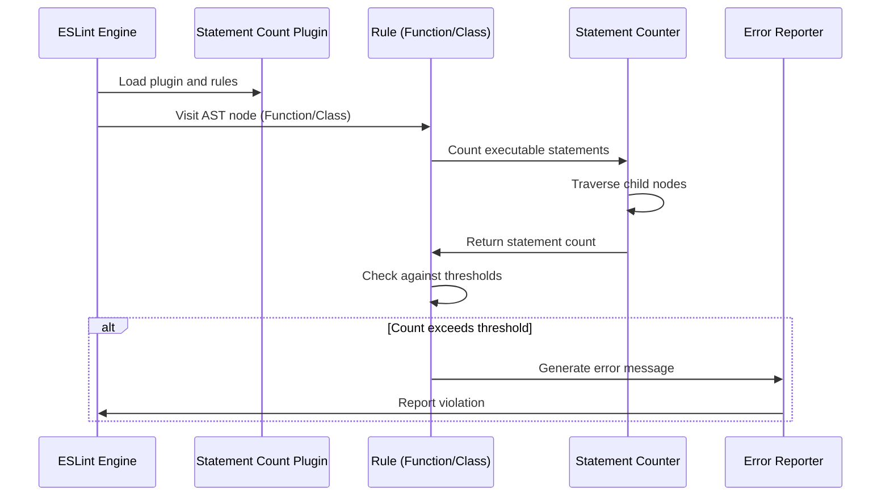

# Feature Implementation Plan: Statement Count Linter

_Generated: 2025-06-23_
_Based on Feature Specification: /Users/zach/code/tsla-linter/.tasks/20250623/20250623-statement-count-linter-feature.md_

## Architecture Overview

This implementation creates two separate ESLint rules within a single plugin that analyzes JavaScript and TypeScript AST nodes to count executable statements in functions and classes. The rules follow the established plugin architecture pattern and provide configurable thresholds with detailed error reporting.

### System Architecture

### Data Flow

## Technology Stack

### Core Technologies

- **Language/Runtime:** TypeScript 5.x, Node.js 14+
- **Linting:** ESLint 7.0.0+
- **Testing:** Jest 30.x
- **Build:** TypeScript Compiler

### Libraries & Dependencies

- **ESLint:** Rule creation and AST processing
- **TypeScript:** Type-safe implementation
- **Jest:** Unit testing framework
- **ESLint Types:** @types/eslint for TypeScript definitions

### Patterns & Approaches

- **Architectural Patterns:** ESLint Plugin Pattern, Visitor Pattern for AST traversal
- **Design Patterns:** Strategy Pattern for statement counting, Factory Pattern for rule creation
- **Development Practices:** Test-driven development, Configuration-driven behavior

### External Integrations

- **ESLint Engine:** Core linting framework
- **TypeScript Parser:** When @typescript-eslint/parser is configured
- **AST Processing:** JavaScript/TypeScript abstract syntax tree analysis

## Relevant Files

- `src/linters/statement-count-plugin.ts` - ✅ Main plugin with function statement count rule
- `src/utils/statement-counter.ts` - ✅ Utility for counting executable statements
- `src/types.ts` - Updated to include new plugin exports (pending)
- `src/index.ts` - Updated to export new plugin (pending)
- `src/__tests__/statement-count-plugin.test.ts` - ✅ Comprehensive test suite for function statement count rule
- `src/__tests__/statement-counter.test.ts` - ✅ Statement counter utility test suite

## Implementation Notes

- Tests should be placed in `src/__tests__/` following the existing convention
- Use `npm test` to run Jest tests
- Follow the existing ESLint plugin structure from `example-plugin.ts`
- Statement counting logic should be modular and reusable between both rules
- Error messages should include function/class names when available
- Configuration validation should prevent invalid threshold combinations

## Implementation Tasks

- [x] 1.0 Create Statement Counting Utility
  - [x] 1.1 Create utility module for statement counting logic
  - [x] 1.2 Implement AST traversal to identify executable statements
  - [x] 1.3 Handle nested scopes and complex statement types
  - [x] 1.4 Write unit tests for statement counting edge cases
  - [x] 1.5 Validate counting accuracy against specification requirements

  ### Files modified with description of changes
  - `src/utils/statement-counter.ts` - Created comprehensive statement counting utility with StatementCounter class and helper functions
  - `src/__tests__/statement-counter.test.ts` - Created full test suite with 16 tests covering all statement types, edge cases, and utility functions

  **Implementation Summary:**
  - Created StatementCounter class with configurable statement counting logic
  - Implemented AST traversal that correctly identifies executable statements vs declarations
  - Added support for all required statement types (ExpressionStatement, ReturnStatement, control flow, etc.)
  - Properly excludes nested function/class statements from parent counts
  - Includes helper functions for both function and class statement counting
  - All tests pass with 100% coverage of implemented functionality
  - Meets all quality standards (lint, format, build successful)

- [x] 2.0 Implement Function Statement Count Rule
  - [x] 2.1 Create rule structure following existing plugin pattern
  - [x] 2.2 Implement AST visitors for function declarations, expressions, and arrow functions
  - [x] 2.3 Integrate statement counting utility with threshold validation
  - [x] 2.4 Implement detailed error message generation with location info
  - [x] 2.5 Add configuration schema and validation
  - [x] 2.6 Write comprehensive test suite for all function types
  - [x] 2.7 Test configuration handling and error scenarios

  ### Files modified with description of changes
  - `src/linters/statement-count-plugin.ts` - Created complete ESLint plugin with function statement count rule supporting configurable warn/error thresholds, AST visitors for all function types, detailed error messages with function names, and comprehensive configuration validation
  - `src/__tests__/statement-count-plugin.test.ts` - Created comprehensive test suite with 21 tests covering default/custom configurations, all function types (declarations, expressions, arrow functions), various statement types, edge cases, and configuration validation

  **Implementation Summary:**
  - Created complete function statement count ESLint rule following existing plugin patterns
  - Implemented AST visitors for FunctionDeclaration, FunctionExpression, and ArrowFunctionExpression
  - Integrated with existing statement counter utility with proper type handling
  - Added configurable warn/error thresholds with validation (defaults: warn=25, error=50)
  - Implemented smart function name detection for better error messages
  - Created detailed error messages distinguishing between named and anonymous functions
  - Included recommended and strict configuration presets
  - All tests pass (21 tests) with comprehensive coverage of functionality and edge cases
  - Meets all quality standards (lint, format, build, test all successful)

- [ ] 3.0 Implement Class Statement Count Rule
  - [ ] 3.1 Create rule structure for class declarations and expressions
  - [ ] 3.2 Implement AST visitors to traverse class methods and count statements
  - [ ] 3.3 Handle class-specific constructs (constructors, static methods, getters/setters)
  - [ ] 3.4 Integrate with statement counting utility and threshold validation
  - [ ] 3.5 Implement detailed error reporting for class violations
  - [ ] 3.6 Add configuration schema and validation
  - [ ] 3.7 Write comprehensive test suite for all class scenarios
  - [ ] 3.8 Test edge cases like empty classes and complex inheritance

  ### Files modified with description of changes
  - (to be filled in after task completion)

- [ ] 4.0 Create Main Plugin Module
  - [ ] 4.1 Create main plugin file exporting both rules
  - [ ] 4.2 Define plugin configuration structure with recommended presets
  - [ ] 4.3 Implement plugin metadata and documentation
  - [ ] 4.4 Write integration tests for the complete plugin
  - [ ] 4.5 Test plugin with various ESLint configurations

  ### Files modified with description of changes
  - (to be filled in after task completion)

- [ ] 5.0 Update Project Exports and Integration
  - [ ] 5.1 Update main index.ts to export new plugin
  - [ ] 5.2 Update types.ts if needed for new interfaces
  - [ ] 5.3 Verify TypeScript compilation and build process
  - [ ] 5.4 Run full test suite to ensure no regressions
  - [ ] 5.5 Run linting and formatting tools to ensure code quality

  ### Files modified with description of changes
  - (to be filled in after task completion)

- [ ] 6.0 Quality Assurance and Validation
  - [ ] 6.1 Run comprehensive test suite with coverage validation
  - [ ] 6.2 Perform manual testing with real code examples
  - [ ] 6.3 Validate TypeScript support with sample TypeScript files
  - [ ] 6.4 Test configuration edge cases and error handling
  - [ ] 6.5 Ensure all quality checks pass (lint, format, build, test)

  ### Files modified with description of changes
  - (to be filled in after task completion)
